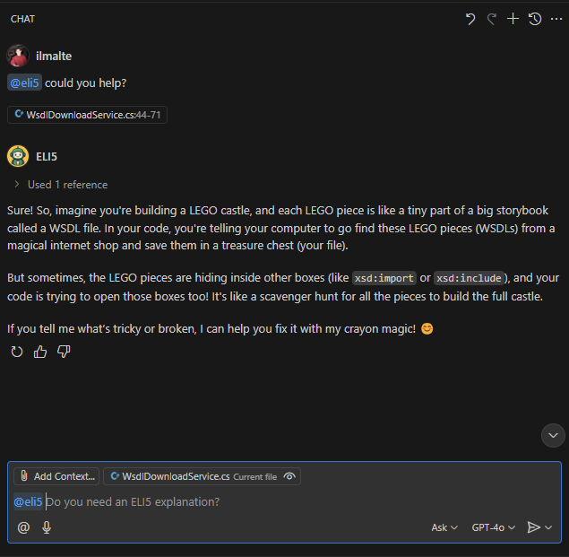

# ELI5 Copilot Chat

(Quickly created) GitHub Copilot Chat extension that can answer questions about a codebase like you are 5 (ELI5).
The partecipant is a super smart 5-year-old that will explain you things like you have the same age.

## Overview

Visual Studio Code's Copilot Chat architecture enables extension authors to integrate with the GitHub Copilot Chat experience. A chat extension is a VS Code extension that uses the Chat extension API by contributing a Chat participant. Chat participants are domain experts that can answer user queries within a specific domain.

The Language Model API enables you to use the Language Model and integrate AI-powered features and natural language processing into your Visual Studio Code extension.

When an extension uses the Chat or the Language Model API, it is referred to as a GitHub Copilot Extension, since GitHub Copilot is the provider of the Chat and the Language Model experience.

This GitHub Copilot Extension sample demonstrates:

- How to contribute a simple chat participant to the GitHub Copilot Chat view (`@eli5Ask`, [simple.ts](src/simple.ts)).
- How to use the Language Model API to request access to the Language Model.
- How to use the `@vscode/chat-extension-utils` library to easily create a chat participant that uses tools (`@eli5`, [chatUtilsSample.ts](src/chatUtilsSample.ts)).
- How to contribute a more sophisticated chat participant that uses the LanguageModelTool API to contribute and invoke tools (`@tool`, [toolParticipant.ts](src/toolParticipant.ts)).

## Documentation

For more information, refer to the following resources:
- [Chat Extension Guide](https://code.visualstudio.com/api/extension-guides/chat)
- [Language Model API Guide](https://code.visualstudio.com/api/extension-guides/language-model)

## Running the Sample

1. Run `pnpm install` in the terminal to install dependencies.
2. Run the `Run Extension` target in the Debug View. This will:
   - Start the `npm: watch` task to compile the code.
   - Launch the extension in a new VS Code window.
   - Display the `@eli5` chat participant in the GitHub Copilot Chat view.

## About this Sample

This sample demonstrates two different ways to build a chat participant in VS Code:

- See [simple.ts](src/simple.ts) for an example of a simple chat participant that makes requests and responds to user queries. It shows how you can create chat participants with or without the [@vscode/prompt-tsx](https://www.npmjs.com/package/@vscode/prompt-tsx) library.

- See [toolParticipant.ts](src/toolParticipant.ts) for an example of a chat participant that invokes tools, either dynamically or using the `toolReferences` attached to the request. This advanced example demonstrates how to use the [@vscode/prompt-tsx](https://www.npmjs.com/package/@vscode/prompt-tsx) library to implement the LLM tool-calling flow and leverage all the features of the chat API.
# vscode-copilot-eli5
